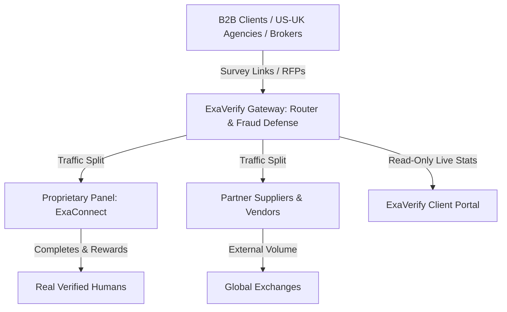
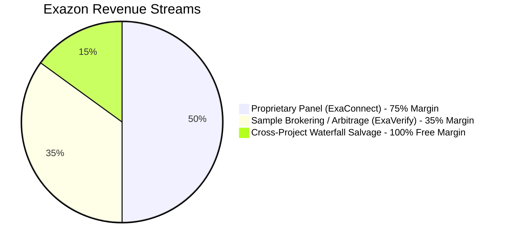
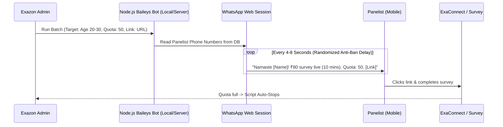
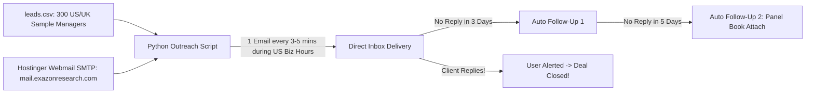
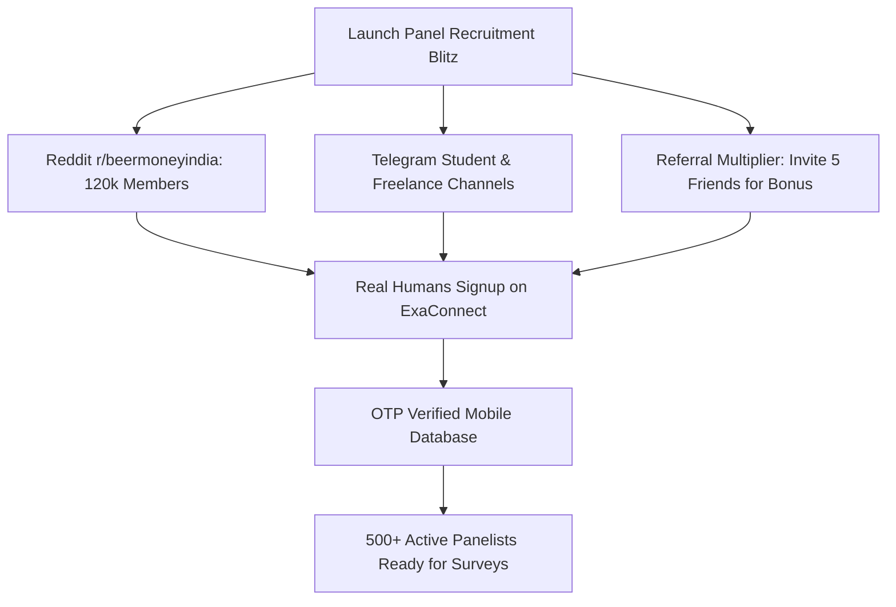
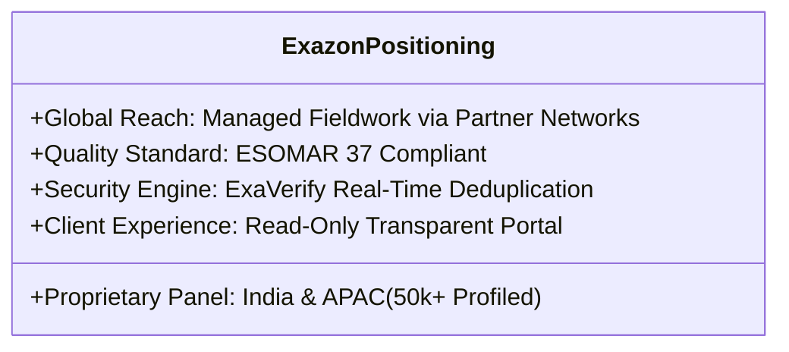
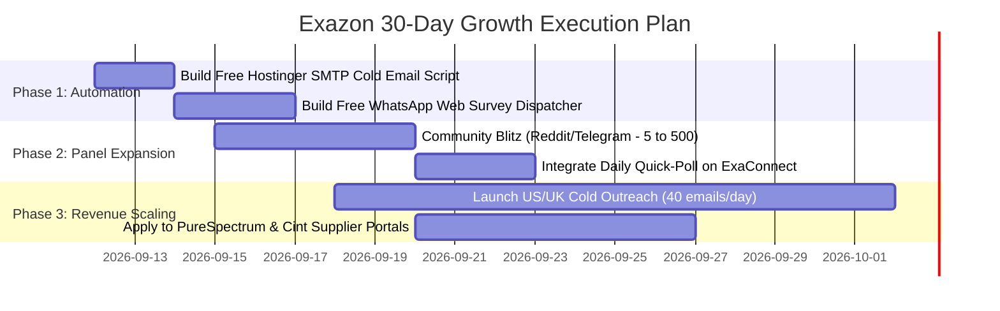

# 🏛️ EXAZON RESEARCH: MASTER STRATEGIC & TECHNICAL BLUEPRINT
**Confidential & Actionable Partner Roadmap**

---

## 📑 TABLE OF CONTENTS
1. [Executive Summary & Current Assets](#1-executive-summary--current-assets)
2. [The 3 Cash-Flow Engines (How Money is Made)](#2-the-3-cash-flow-engines-how-money-is-made)
3. [Automation Engine 1: WhatsApp Survey Dispatcher (100% Free)](#3-automation-engine-1-whatsapp-survey-dispatcher-100-free)
4. [Automation Engine 2: International B2B Cold Outreach Engine (100% Free)](#4-automation-engine-2-international-b2b-cold-outreach-engine-100-free)
5. [The Panelist Scaling Playbook (From 5 to 500+ in 7–10 Days)](#5-the-panelist-scaling-playbook-from-5-to-500-in-710-days)
6. [Survey Security & Fraud Defense Deep-Dive (Why Traffic Fails)](#6-survey-security--fraud-defense-deep-dive-why-traffic-fails)
7. [Enterprise Client Pitch & Positioning (Winning US/UK Contracts)](#7-enterprise-client-pitch--positioning-winning-usuk-contracts)
8. [Immediate Step-by-Step Execution Roadmap](#8-immediate-step-by-step-execution-roadmap)

---

## 1. EXECUTIVE SUMMARY & CURRENT ASSETS

Exazon Research operates in the high-growth **Online Sample & Market Research Operations** industry. The company currently possesses enterprise-grade infrastructure deployed on Hostinger:

### Existing Asset Inventory:
| Platform / Asset | Location / Domain | Core Function |
|---|---|---|
| **ExaVerify** | `exaverify.exazonresearch.com` | Survey routing, S2S callbacks, vendor mapping, click limits, quality scoring (`quality_score.php`). |
| **ExaConnect** | `exaconnect.exazonresearch.com` | Panelist registration, OTP verification, profiling questionnaires, wallet/points, Tremendous reward integration. |
| **Client Portal** | `exaverify.../client/portal.php` | Read-only client dashboard displaying live progress, completes, and quota without revealing internal vendor costs or margins. |
| **Main Website** | `exazonresearch.com` | Client-facing brand site, lead generation forms, and respondent intake. |
| **Credibility Docs** | Local / Hosted | **ESOMAR 37 Transparency Report** and **Exazon Panel Book** (Audience Demographics & Reach). |

---

## 2. THE 3 CASH-FLOW ENGINES (HOW MONEY IS MADE)

### Model 1: Proprietary Panel Delivery (ExaConnect) — *75% to 85% Gross Margin*
* **Client Payment (CPI):** \$3.00 to \$5.00 (₹250 – ₹420) per completed survey.
* **Panelist Payout:** ₹50 – ₹70 (UPI/Gift Voucher).
* **Net Margin:** **₹180 to ₹350 per complete**.
* **Scale Potential:** At 50 completes/day = **₹3,00,000 net profit/month**.

### Model 2: Sample Brokering / Arbitrage (ExaVerify) — *30% to 40% Margin (Zero Panel Needed)*
* **Client Payment (CPI):** \$4.50 (₹380).
* **Vendor Cost (CPI):** \$2.80 (₹235) mapped via ExaVerify.
* **Your Commission:** **\$1.70 (₹145) per complete** sitting in the middle.
* **Scale Potential:** On a 1,000-sample B2B project = **\$1,700 (₹1.4 Lakhs) pure profit** with zero internal panelists.

### Model 3: Smart Cross-Project Waterfalling — *Free Extra Cash from Screenouts*
* **Normal System:** 1,000 clicks come in. 150 qualify. 850 screen out and leave (₹0 earned).
* **Waterfall System:** ExaVerify intercepts the 850 screenouts and immediately routes them to Project B or C.
* **Result:** Even a 15% recovery rate creates an extra **125 completes = \$375 (₹31,000) pure found money**.

---

## 3. AUTOMATION ENGINE 1: WHATSAPP SURVEY DISPATCHER (100% FREE)

### Why Build It?
* Email open rate in India/APAC is only 15–18% and takes 24–48 hours.
* WhatsApp open rate is **95%+** with response times under 15 minutes.
* **Impact:** Projects close in 2 hours instead of 2 days. Faster turnaround = more repeat business from clients.

### Technical Architecture (Zero-Cost):

### Key Technical Safeguards:
1. **Human-Paced Delays:** 4 to 8 seconds randomized sleep between sends prevents WhatsApp spam triggers.
2. **Session Persistence:** One-time QR scan creates a persistent authentication folder (`/auth_info_baileys`); no need to scan every time.
3. **Opt-in Only:** Sent only to registered ExaConnect panelists who checked "Get WhatsApp alerts".

---

## 4. AUTOMATION ENGINE 2: INTERNATIONAL B2B COLD OUTREACH ENGINE (100% FREE)

### Why Build It?
* Domestic sub-brokers (MarketMirror, Epitome) pay ₹180–₹250 per complete.
* Direct US, UK, and European agencies pay **\$7.00 to \$15.00 (₹600–₹1,250)** for the exact same sample.

### Technical Architecture (Hostinger SMTP):

### The High-Converting Cold Email Template:

> **Subject:** APAC / India fieldwork feasibility for {{Company}}?
>
> *Hi {{First_Name}},*
>
> *Saw you direct fieldwork at {{Company}}. Many research agencies are currently frustrated by bot fraud, proxy abuse, and low incidence rates when sourcing Indian & APAC sample.*
>
> *At **Exazon Research**, we operate an **ESOMAR 37-compliant** proprietary panel with active digital fingerprinting (ExaVerify) to guarantee 0% duplicate and bot completes.*
>
> *Do you have any current or upcoming B2B / Consumer studies where you need rapid feasibility or competitive CPI quotes?*
>
> *Happy to run a complimentary 20-sample test batch on your active link to demonstrate our data quality.*
>
> *Best regards,*  
> **[Your Name]** | Founder, Exazon Research  
> `exazonresearch.com` | `exaverify.exazonresearch.com`

---

## 5. THE PANELIST SCALING PLAYBOOK (FROM 5 TO 500+ IN 7–10 DAYS)

Instead of risking bans with fake proxy automation, build a real, responsive panel for ₹0:

### Step-by-Step Channels:
1. **Reddit (`r/beermoneyindia`):**
   * Post title: *"Exazon Research: New verified Indian survey panel with direct UPI / Amazon voucher payouts (10-min surveys)."*
   * Yield: 200–400 verified signups within 48 hours.
2. **College & Freelance WhatsApp/Telegram Channels:**
   * Distribute the ExaConnect registration link targeting students looking for pocket money.
3. **Internal Referral Incentive:**
   * Give existing panelists ₹20 in points for each verified friend they refer.

---

## 6. SURVEY SECURITY & FRAUD DEFENSE DEEP-DIVE (WHY TRAFFIC FAILS)

Clients like **InnovateMR, Decipher, Qualtrics, and Dynata** use aggressive pre-survey gatekeepers. Understanding them prevents project failures:

| Security Engine | Used By | What It Checks | Why Traffic Fails |
|---|---|---|---|
| **Verisoul** | InnovateMR, modern platforms | Behavioral biometrics (cursor jitter, keystroke cadence), browser integrity, anti-detect browser signatures. | Bot automation, Puppeteer/Selenium, GoLogin/Multilogin canvas flags. |
| **MaxMind minFraud / GeoIP2** | Decipher, Qualtrics, Forsta | IP Risk Score (0–100), ASN type (Residential vs Datacenter/Hosting), VPN/Tor exit nodes. | Datacenter proxies, commercial VPNs, IP/Location mismatch. |
| **Imperium (RelevantID)** | Dynata, Kantar, Toluna | Machine fingerprinting (50+ hardware/OS attributes), 30-day cross-survey duplicate detection, speeder limits. | Same respondent taking multiple surveys, virtual GPUs (`SwiftShader`). |
| **Research Defender / CleanID** | Enterprise MRX | Open-ended text quality, ChatGPT/LLM text detection, clipboard copy-pasting checks. | Respondents pasting text into open-ended boxes. |
| **In-Survey Traps** | Programmers | Honeypot questions (hidden in CSS), Instructional Manipulation Checks (IMC), straightlining on grids. | Fast-clickers answering without reading, bots hitting hidden HTML fields. |
| **WebRTC Leak** | Verisoul, Decipher | Probes browser WebRTC to reveal actual underlying router IP/ISP. | Proxy hides public IP, but WebRTC leaks real Indian ISP (Jio/Airtel). |

### The Golden Rule of Sample Delivery:
> Real humans on their own smartphones (4G/5G mobile data or home broadband) reading questions carefully will **pass 100% of security checks** without a single block.

---

## 7. ENTERPRISE CLIENT PITCH & POSITIONING (WINNING US/UK CONTRACTS)

When pitching international enterprise buyers, **never claim to have a global proprietary panel** (which invites impossible audits). Position Exazon with the industry-standard agency model:

### What B2B Clients Actually Care About:
1. **Not Google Analytics:** B2B buyers never look at GA4 or Search Console. Sample fieldwork is conducted via private routing links.
2. **Speed & Feasibility:** Can you deliver 50 completes in 48 hours at a competitive CPI?
3. **Data Authenticity:** 0% bot contamination and clear replacement policies for any client-side rejects.
4. **S2S Integration:** Clean redirect links (`Complete`, `Terminate`, `OverQuota`, `SecurityFail`).

---

## 8. IMMEDIATE STEP-BY-STEP EXECUTION ROADMAP

### Action Items Ready for Implementation:
1. **Run SMTP Outreach Engine:** Load 50 target US/UK Sample Managers and start automated business-hours drip sending.
2. **Deploy WhatsApp Dispatcher:** Connect secondary phone via QR scan and test first 10-panelist survey alert.
3. **Deliver Active Studies:** Use ExaVerify vendor mapping to fulfill current projects from MarketMirror and Epitome cleanly.
